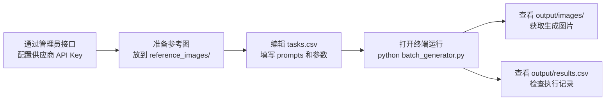

# BOLI AI 批量图片生成工具 — 技术方案设计

> ⚠️ **本文档已过时**：命令行版（CLI）已迁移至独立项目，
> 本平台现为 Web 版（FastAPI + 前端界面），架构详见 [README](../README.md)。
> 以下内容仅作为 CLI 时期的历史设计参考。

## 1. 技术选型

| 组件 | 选型 | 理由 |
|------|------|------|
| 语言 | Python 3.8+ | 开发效率高，HTTP/文件处理生态完善 |
| HTTP 请求 | `requests` | 最主流的 HTTP 库，支持 multipart/form-data 文件上传 |
| 配置管理 | 数据库 `api_providers` 表 + 环境变量 | 供应商 Key 入库，平台密钥走环境变量 |
| 并发处理 | `concurrent.futures.ThreadPoolExecutor` | Python 原生线程池，简单可控 |
| 任务输入 | CSV 格式（`csv` 标准库） | 通用性强，Excel/WPS可直接编辑 |
| 依赖管理 | `requirements.txt` | 最小化依赖，仅 requests + python-dotenv |

## 2. 整体架构

```
┌─────────────────────────────────────────────────────┐
│                   batch_generator.py                  │
│                                                       │
│  ┌──────────┐   ┌──────────────┐   ┌──────────────┐  │
│  │  读取任务   │→│  并发执行器    │→│  保存结果     │  │
│  │ (CSV解析)  │││ (ThreadPool)  │││  (图片+CSV)  │  │
│  └──────────┘ │└──────────────┘│└──────────────┘  │
│               │                │                     │
│  ┌──────────┐ │┌──────────────┐│                     │
│  │ 配置加载   │ ││  文生图调用   ││                     │
│  │ (.env)    │ ││  /generations││                     │
│  └──────────┘ │└──────────────┘│                     │
│               │┌──────────────┐│                     │
│               ││  图生图调用   ││                     │
│               ││  /edits      ││                     │
│               │└──────────────┘│                     │
│               └────────────────┘                     │
└─────────────────────────────────────────────────────┘
         │                        ▲
         ▼                        │
┌────────────────────┐   ┌────────────────────┐
│   DONGLI AI API    │   │   output/          │
│   dilisiko.shop    │   │   ├── images/      │
│                    │   │   └── results.csv   │
└────────────────────┘   └────────────────────┘
```

## 3. 核心模块设计

### 模块 1：供应商配置（数据库 `api_providers` 表）

```
api_providers 表
├── api_key          # 以 sk- 开头的密钥
├── base_url         # API 基础地址，默认 https://dilisiko.shop
├── model            # 默认模型，固定 gpt-image-2
├── enabled          # 是否启用（1/0）
└── priority         # 优先级，数字小的先尝试
```

### 模块 2：任务解析 (`tasks.csv` → List[Dict])

**CSV 列定义：**

| 列名 | 必填 | 说明 | 示例 |
|------|------|------|------|
| `prompt` | ✅ | 图像描述词 | "一只金毛幼犬" |
| `reference_image` | ❌ | 参考图路径，留空=文生图，填写=图生图 | `reference_images/dog.png` |
| `size` | ❌ | 图片尺寸，默认用全局 `DEFAULT_SIZE` | `1024x1024` |
| `n` | ❌ | 生成数量 1-4 | `1` |
| `response_format` | ❌ | 返回格式 url/b64_json | `url` |

**解析逻辑：**
- 跳过空行和 `#` 开头的注释行
- `prompt` 为空的行跳过
- `reference_image` 为空 → 文生图；非空 → 图生图

### 模块 3：并发执行器 (ThreadPoolExecutor)

```
流程：
1. 所有任务放入列表
2. ThreadPoolExecutor(max_workers=CONCURRENCY) 创建线程池
3. 逐个 submit(process_single_task, task)
4. as_completed 收集结果
5. 主线程打印进度
6. 全部完成后写入 results.csv
```

**线程安全：**
- `print_lock`：控制控制台输出不交错
- `results_lock`：控制结果列表写入不冲突

### 模块 4：API 调用层

#### 文生图 `POST /v1/images/generations`

```python
payload = {
    "model": "gpt-image-2",
    "prompt": prompt,
    "n": n,
    "size": size,
    "response_format": fmt
}
requests.post(url, headers=headers, json=payload)
```

#### 图生图 `POST /v1/images/edits`

```python
files = {
    "image": (filename, file_obj, "image/png"),
    "prompt": (None, prompt),
    "model": (None, "gpt-image-2"),
    "n": (None, str(n)),
    "response_format": (None, fmt),
}
requests.post(url, headers={"Authorization": ...}, files=files)
```

### 模块 5：结果保存

**图片保存：**
- 文件名格式：`{prompt前60字符}_{序号}_{时间戳}.png`
- 支持 url 下载 和 b64_json 解码两种方式

**记录保存 (results.csv)：**

| 字段 | 说明 |
|------|------|
| timestamp | 执行时间 |
| prompt | 原始 prompt |
| reference_image | 参考图路径（如有） |
| size | 图片尺寸 |
| n | 生成数量 |
| status | success / failed |
| error | 错误信息（失败时） |
| generated_files | 生成文件路径列表 |

## 4. 错误处理策略

```
                      ┌─────────────┐
                      │  发起 API 调用 │
                      └──────┬──────┘
                             │
                     ┌───────┴───────┐
                     │  请求是否成功?  │
                     └───────┬───────┘
                    ╱                ╲
                  ╱                    ╲
               ✅ 是                   ❌ 否
               │                       │
               ▼                       ▼
        ┌──────────────┐     ┌──────────────────┐
        │ 保存图片+记录  │     │  根据错误码处理    │
        └──────────────┘     └──────────────────┘
                                    │
                          ┌─────────┴──────────┐
                          │ 400/402/500 → 记录  │
                          │ 继续下一个任务       │
                          │                    │
                          │ 401 → 终止所有任务  │
                          │ 提示用户检查 Key    │
                          └────────────────────┘
```

## 5. 文件清单

| 文件 | 说明 | 用户需编辑？ |
|------|------|------------|
| `api_providers` 表 | API 配置（通过管理员接口维护） | ✅ 需通过接口填写 API Key |
| `tasks.csv` | 批量任务清单 | ✅ 需编辑任务内容 |
| `batch_generator.py` | 主程序 | ❌ 无需修改，直接运行 |
| `requirements.txt` | 依赖清单 | ❌ 仅安装时使用 |
| `reference_images/` | 参考图目录 | ✅ 存放参考图 |

## 6. 使用流程



## 7. 依赖清单 (requirements.txt)

```
requests>=2.28.0
python-dotenv>=1.0.0
```
